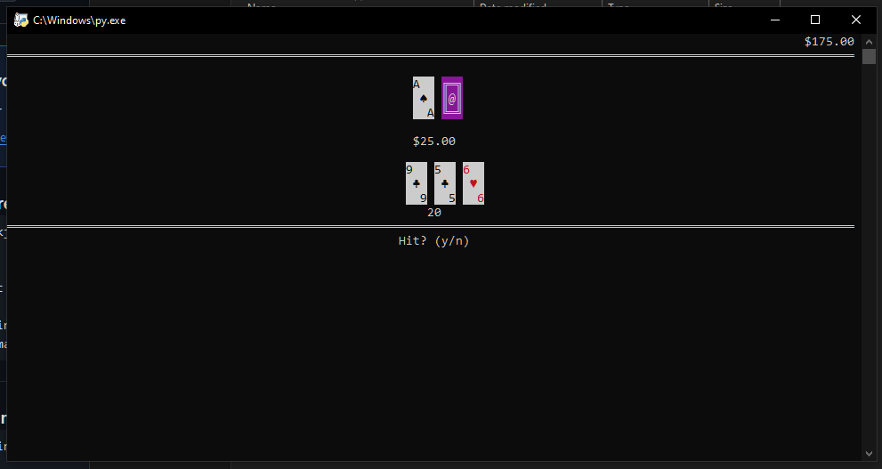

<!--
Hey, thanks for using the awesome-readme-template template.  
If you have any enhancements, then fork this project and create a pull request 
or just open an issue with the label "enhancement".

Don't forget to give this project a star for additional support ;)
Maybe you can mention me or this repo in the acknowledgements too
-->

  <h1>Python-Blackjack</h1>
  

 

 
  

## Usage
- Install color support \[optional\]: `pip install colorama`
- run `python blackjack.py`
- have fun!